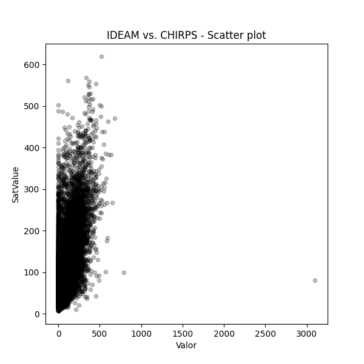
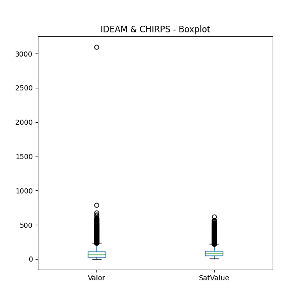
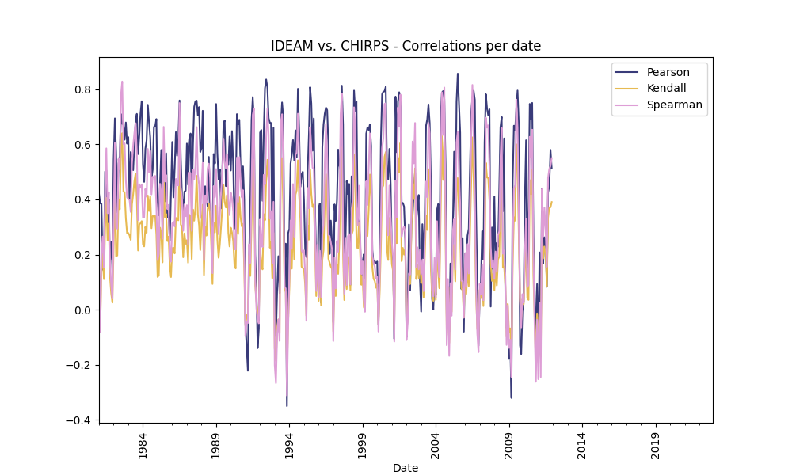
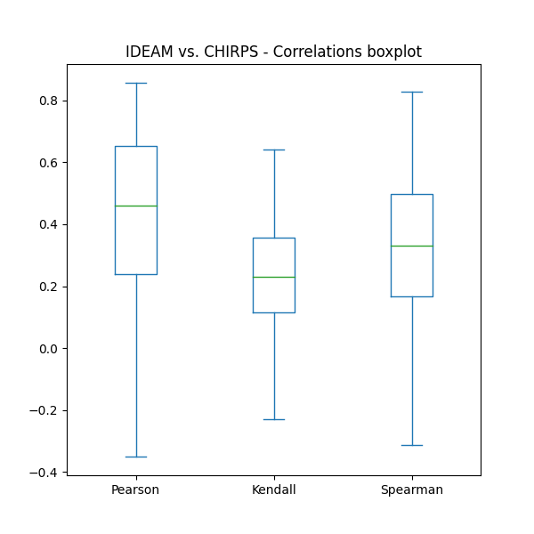
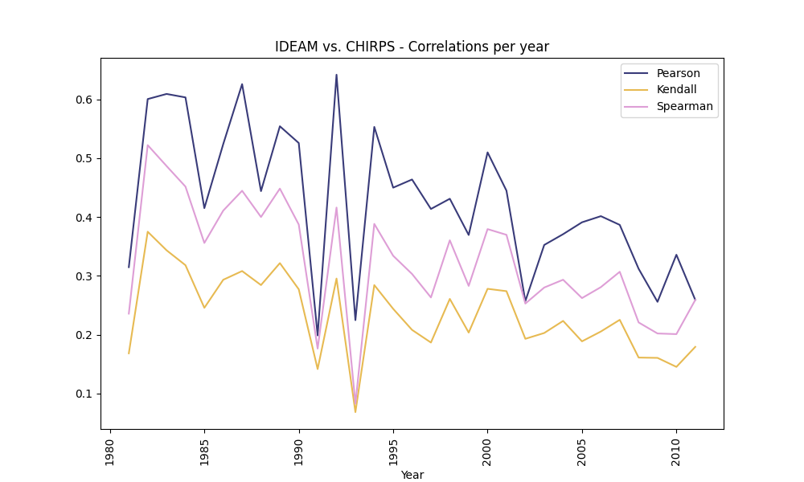
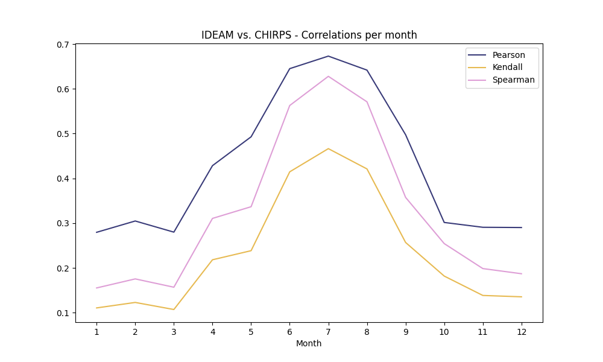

## Obtención de series de datos discretos climatológicos satelitales y correlación con datos terrestres, IDEAM vs. CHIRPS

* Archivo de resultados: C:/R.LTWB/.datasets/CHIRPS/RemoteSensingRainChirps.md
* Fecha y hora de inicio de ejecución: 2023-03-18 10:09:22.945326
* Python versión: 3.11.1 (tags/v3.11.1:a7a450f, Dec  6 2022, 19:58:39) [MSC v.1934 64 bit (AMD64)]
* Python rutas: ['C:\\R.LTWB\\.src', 'C:\\R.LTWB', 'C:\\Users\\jahoa\\AppData\\Local\\Programs\\Python\\Python311\\python311.zip', 'C:\\Users\\jahoa\\AppData\\Local\\Programs\\Python\\Python311\\DLLs', 'C:\\Users\\jahoa\\AppData\\Local\\Programs\\Python\\Python311\\Lib']
* matplotlib versión: 3.6.3
* Encuentra este script en https://github.com/rcfdtools/R.LTWB/tree/main/Section03/RemoteSensing
* Cláusulas y condiciones de uso en https://github.com/rcfdtools/R.LTWB/blob/main/LICENSE.md
* Créditos: r.cfdtools@gmail.com

### General dataframe information

* IDEAM records: 65756
* Filtered records for Etiqueta == "PTPM_TT_M": 59971 (91.2%)

### General IDEAM vs. CHIRPS - Plots

Processed .csv file [IDEAMJoinedChirps.csv](IDEAMJoinedChirps.csv)

### Correlation Analysis

The correlation methods used for the analysis are:

* [Pearson correlation coefficient](https://en.wikipedia.org/wiki/Pearson_correlation_coefficient)  
* [Kendall rank correlation coefficient](https://en.wikipedia.org/wiki/Kendall_rank_correlation_coefficient)  
* [Spearman’s rank correlation coefficient](https://en.wikipedia.org/wiki/Spearman%27s_rank_correlation_coefficient)  

#### Correlation values for the date records

The following table, shows the monthly average correlation values obtained from the IDEAM records and the correspondent Chirps values.
Get the table [IDEAMJoinedChirpsCorrelationDate.csv](IDEAMJoinedChirpsCorrelationDate.csv) 

| Date                |   Year |   Month |       Pearson |      Kendall |     Spearman |
|:--------------------|-------:|--------:|--------------:|-------------:|-------------:|
| 1981-01-01 00:00:00 |   1981 |       1 |   0.419611    |   0.150335   |   0.201074   |
| 1981-02-01 00:00:00 |   1981 |       2 |   0.385361    |  -0.0579736  |  -0.0810786  |
| 1981-03-01 00:00:00 |   1981 |       3 |   0.384366    |   0.137211   |   0.198152   |
| 1981-04-01 00:00:00 |   1981 |       4 |   0.145299    |   0.208652   |   0.26554    |
| 1981-05-01 00:00:00 |   1981 |       5 |   0.163485    |   0.110649   |   0.154231   |
| 1981-06-01 00:00:00 |   1981 |       6 |   0.501462    |   0.296742   |   0.424518   |
| 1981-07-01 00:00:00 |   1981 |       7 |   0.505016    |   0.405525   |   0.58535    |
| 1981-08-01 00:00:00 |   1981 |       8 |   0.315165    |   0.250609   |   0.349595   |
| 1981-09-01 00:00:00 |   1981 |       9 |   0.399722    |   0.312937   |   0.426488   |
| 1981-10-01 00:00:00 |   1981 |      10 |   0.130175    |   0.119927   |   0.175964   |
| 1981-11-01 00:00:00 |   1981 |      11 |   0.246418    |   0.0584521  |   0.0887304  |
| 1981-12-01 00:00:00 |   1981 |      12 |   0.181115    |   0.025666   |   0.0401418  |
| 1982-01-01 00:00:00 |   1982 |       1 |   0.545313    |   0.2261     |   0.328765   |
| 1982-02-01 00:00:00 |   1982 |       2 |   0.694451    |   0.437329   |   0.605001   |
| 1982-03-01 00:00:00 |   1982 |       3 |   0.570195    |   0.194315   |   0.296054   |
| 1982-04-01 00:00:00 |   1982 |       4 |   0.353034    |   0.196664   |   0.294074   |
| 1982-05-01 00:00:00 |   1982 |       5 |   0.529641    |   0.400542   |   0.546905   |
| 1982-06-01 00:00:00 |   1982 |       6 |   0.558122    |   0.36408    |   0.509321   |
| 1982-07-01 00:00:00 |   1982 |       7 |   0.709995    |   0.578017   |   0.778429   |
| 1982-08-01 00:00:00 |   1982 |       8 |   0.674383    |   0.640682   |   0.828275   |
| 1982-09-01 00:00:00 |   1982 |       9 |   0.672973    |   0.428354   |   0.600542   |
| 1982-10-01 00:00:00 |   1982 |      10 |   0.616927    |   0.426027   |   0.603536   |
| 1982-11-01 00:00:00 |   1982 |      11 |   0.679419    |   0.330718   |   0.467952   |
| 1982-12-01 00:00:00 |   1982 |      12 |   0.602457    |   0.277444   |   0.407942   |
| 1983-01-01 00:00:00 |   1983 |       1 |   0.626208    |   0.27837    |   0.401332   |
| 1983-02-01 00:00:00 |   1983 |       2 |   0.400163    |   0.269225   |   0.398545   |
| 1983-03-01 00:00:00 |   1983 |       3 |   0.572141    |   0.253142   |   0.354497   |
| 1983-04-01 00:00:00 |   1983 |       4 |   0.542533    |   0.382207   |   0.528657   |
| 1983-05-01 00:00:00 |   1983 |       5 |   0.506067    |   0.418847   |   0.596397   |
| 1983-06-01 00:00:00 |   1983 |       6 |   0.60216     |   0.466986   |   0.642122   |
| 1983-07-01 00:00:00 |   1983 |       7 |   0.686144    |   0.49469    |   0.676833   |
| 1983-08-01 00:00:00 |   1983 |       8 |   0.710741    |   0.399015   |   0.565947   |
| 1983-09-01 00:00:00 |   1983 |       9 |   0.564467    |   0.214758   |   0.324787   |
| 1983-10-01 00:00:00 |   1983 |      10 |   0.631198    |   0.309097   |   0.455265   |
| 1983-11-01 00:00:00 |   1983 |      11 |   0.712746    |   0.313377   |   0.442405   |
| 1983-12-01 00:00:00 |   1983 |      12 |   0.756693    |   0.321296   |   0.453249   |
| 1984-01-01 00:00:00 |   1984 |       1 |   0.52741     |   0.237054   |   0.333599   |
| 1984-02-01 00:00:00 |   1984 |       2 |   0.46351     |   0.229409   |   0.33493    |
| 1984-03-01 00:00:00 |   1984 |       3 |   0.584316    |   0.30047    |   0.438239   |
| 1984-04-01 00:00:00 |   1984 |       4 |   0.614594    |   0.278825   |   0.409768   |
| 1984-05-01 00:00:00 |   1984 |       5 |   0.743673    |   0.414185   |   0.583226   |
| 1984-06-01 00:00:00 |   1984 |       6 |   0.680358    |   0.357848   |   0.497958   |
| 1984-07-01 00:00:00 |   1984 |       7 |   0.624019    |   0.41099    |   0.575502   |
| 1984-08-01 00:00:00 |   1984 |       8 |   0.475156    |   0.295479   |   0.418437   |
| 1984-09-01 00:00:00 |   1984 |       9 |   0.508228    |   0.339635   |   0.482394   |
| 1984-10-01 00:00:00 |   1984 |      10 |   0.66323     |   0.338657   |   0.479654   |
| 1984-11-01 00:00:00 |   1984 |      11 |   0.66441     |   0.340879   |   0.485579   |
| 1984-12-01 00:00:00 |   1984 |      12 |   0.691838    |   0.27346    |   0.38125    |
| 1985-01-01 00:00:00 |   1985 |       1 |   0.389961    |   0.118412   |   0.179857   |
| 1985-02-01 00:00:00 |   1985 |       2 |   0.342024    |   0.124183   |   0.202202   |
| 1985-03-01 00:00:00 |   1985 |       3 |   0.456492    |   0.297596   |   0.456837   |
| 1985-04-01 00:00:00 |   1985 |       4 |   0.579456    |   0.279181   |   0.420569   |
| 1985-05-01 00:00:00 |   1985 |       5 |   0.306258    |   0.171401   |   0.25715    |
| 1985-06-01 00:00:00 |   1985 |       6 |   0.582629    |   0.485551   |   0.663502   |
| 1985-07-01 00:00:00 |   1985 |       7 |   0.392656    |   0.335293   |   0.46497    |
| 1985-08-01 00:00:00 |   1985 |       8 |   0.5675      |   0.347158   |   0.488426   |
| 1985-09-01 00:00:00 |   1985 |       9 |   0.335468    |   0.248729   |   0.36487    |
| 1985-10-01 00:00:00 |   1985 |      10 |   0.350656    |   0.265092   |   0.379619   |
| 1985-11-01 00:00:00 |   1985 |      11 |   0.249224    |   0.156689   |   0.218885   |
| 1985-12-01 00:00:00 |   1985 |      12 |   0.428964    |   0.11817    |   0.174083   |
| 1986-01-01 00:00:00 |   1986 |       1 |   0.608649    |   0.223268   |   0.313175   |
| 1986-02-01 00:00:00 |   1986 |       2 |   0.407356    |   0.224188   |   0.318509   |
| 1986-03-01 00:00:00 |   1986 |       3 |   0.511693    |   0.204001   |   0.301991   |
| 1986-04-01 00:00:00 |   1986 |       4 |   0.644534    |   0.332922   |   0.474619   |
| 1986-05-01 00:00:00 |   1986 |       5 |   0.558829    |   0.328276   |   0.463221   |
| 1986-06-01 00:00:00 |   1986 |       6 |   0.623384    |   0.324006   |   0.45077    |
| 1986-07-01 00:00:00 |   1986 |       7 |   0.75949     |   0.567513   |   0.750073   |
| 1986-08-01 00:00:00 |   1986 |       8 |   0.549137    |   0.308948   |   0.445201   |
| 1986-09-01 00:00:00 |   1986 |       9 |   0.411649    |   0.300797   |   0.406167   |
| 1986-10-01 00:00:00 |   1986 |      10 |   0.35257     |   0.190092   |   0.286354   |
| 1986-11-01 00:00:00 |   1986 |      11 |   0.428721    |   0.276492   |   0.381939   |
| 1986-12-01 00:00:00 |   1986 |      12 |   0.431805    |   0.238857   |   0.338871   |
| 1987-01-01 00:00:00 |   1987 |       1 |   0.602833    |   0.252265   |   0.379193   |
| 1987-02-01 00:00:00 |   1987 |       2 |   0.453428    |   0.170232   |   0.237406   |
| 1987-03-01 00:00:00 |   1987 |       3 |   0.592668    |   0.344345   |   0.497215   |
| 1987-04-01 00:00:00 |   1987 |       4 |   0.639366    |   0.340444   |   0.495949   |
| 1987-05-01 00:00:00 |   1987 |       5 |   0.363133    |   0.183386   |   0.28568    |
| 1987-06-01 00:00:00 |   1987 |       6 |   0.595133    |   0.363188   |   0.508801   |
| 1987-07-01 00:00:00 |   1987 |       7 |   0.73627     |   0.322805   |   0.472413   |
| 1987-08-01 00:00:00 |   1987 |       8 |   0.75657     |   0.366307   |   0.519672   |
| 1987-09-01 00:00:00 |   1987 |       9 |   0.758745    |   0.485791   |   0.662559   |
| 1987-10-01 00:00:00 |   1987 |      10 |   0.705628    |   0.345902   |   0.491799   |
| 1987-11-01 00:00:00 |   1987 |      11 |   0.735502    |   0.306549   |   0.453444   |
| 1987-12-01 00:00:00 |   1987 |      12 |   0.572186    |   0.216373   |   0.331771   |
| 1988-01-01 00:00:00 |   1988 |       1 |   0.586827    |   0.313799   |   0.444249   |
| 1988-02-01 00:00:00 |   1988 |       2 |   0.721874    |   0.381012   |   0.532641   |
| 1988-03-01 00:00:00 |   1988 |       3 |   0.216595    |   0.125527   |   0.179279   |
| 1988-04-01 00:00:00 |   1988 |       4 |   0.447779    |   0.301314   |   0.414609   |
| 1988-05-01 00:00:00 |   1988 |       5 |   0.41438     |   0.268779   |   0.387384   |
| 1988-06-01 00:00:00 |   1988 |       6 |   0.374036    |   0.364159   |   0.511935   |
| 1988-07-01 00:00:00 |   1988 |       7 |   0.554387    |   0.385531   |   0.529956   |
| 1988-08-01 00:00:00 |   1988 |       8 |   0.384484    |   0.349674   |   0.480443   |
| 1988-09-01 00:00:00 |   1988 |       9 |   0.289072    |   0.232971   |   0.330895   |
| 1988-10-01 00:00:00 |   1988 |      10 |   0.243485    |   0.093222   |   0.132476   |
| 1988-11-01 00:00:00 |   1988 |      11 |   0.564786    |   0.31536    |   0.448462   |
| 1988-12-01 00:00:00 |   1988 |      12 |   0.530571    |   0.280231   |   0.408339   |
| 1989-01-01 00:00:00 |   1989 |       1 |   0.746649    |   0.377225   |   0.510283   |
| 1989-02-01 00:00:00 |   1989 |       2 |   0.567382    |   0.25201    |   0.36276    |
| 1989-03-01 00:00:00 |   1989 |       3 |   0.472959    |   0.188385   |   0.273765   |
| 1989-04-01 00:00:00 |   1989 |       4 |   0.509306    |   0.236567   |   0.343347   |
| 1989-05-01 00:00:00 |   1989 |       5 |   0.367256    |   0.29973    |   0.424687   |
| 1989-06-01 00:00:00 |   1989 |       6 |   0.495566    |   0.369074   |   0.492504   |
| 1989-07-01 00:00:00 |   1989 |       7 |   0.674485    |   0.452154   |   0.620495   |
| 1989-08-01 00:00:00 |   1989 |       8 |   0.68637     |   0.390071   |   0.533177   |
| 1989-09-01 00:00:00 |   1989 |       9 |   0.448228    |   0.370548   |   0.511936   |
| 1989-10-01 00:00:00 |   1989 |      10 |   0.530484    |   0.416488   |   0.563626   |
| 1989-11-01 00:00:00 |   1989 |      11 |   0.524827    |   0.278017   |   0.399941   |
| 1989-12-01 00:00:00 |   1989 |      12 |   0.628381    |   0.229317   |   0.343133   |
| 1990-01-01 00:00:00 |   1990 |       1 |   0.505038    |   0.297248   |   0.424308   |
| 1990-02-01 00:00:00 |   1990 |       2 |   0.648184    |   0.279145   |   0.402135   |
| 1990-03-01 00:00:00 |   1990 |       3 |   0.524786    |   0.248685   |   0.356025   |
| 1990-04-01 00:00:00 |   1990 |       4 |   0.294133    |   0.161427   |   0.219898   |
| 1990-05-01 00:00:00 |   1990 |       5 |   0.412764    |   0.149437   |   0.217995   |
| 1990-06-01 00:00:00 |   1990 |       6 |   0.709849    |   0.40664    |   0.552002   |
| 1990-07-01 00:00:00 |   1990 |       7 |   0.673302    |   0.274473   |   0.390832   |
| 1990-08-01 00:00:00 |   1990 |       8 |   0.689133    |   0.407893   |   0.553729   |
| 1990-09-01 00:00:00 |   1990 |       9 |   0.523005    |   0.336059   |   0.475665   |
| 1990-10-01 00:00:00 |   1990 |      10 |   0.410729    |   0.302223   |   0.406894   |
| 1990-11-01 00:00:00 |   1990 |      11 |   0.520067    |   0.311782   |   0.433712   |
| 1990-12-01 00:00:00 |   1990 |      12 |   0.398963    |   0.15038    |   0.213535   |
| 1991-01-01 00:00:00 |   1991 |       1 |  -0.050378    |  -0.0584285  |  -0.096394   |
| 1991-02-01 00:00:00 |   1991 |       2 |  -0.139043    |  -0.0207842  |  -0.0450318  |
| 1991-03-01 00:00:00 |   1991 |       3 |  -0.221864    |  -0.0171102  |  -0.0487956  |
| 1991-04-01 00:00:00 |   1991 |       4 |   0.189192    |   0.196767   |   0.237094   |
| 1991-05-01 00:00:00 |   1991 |       5 |   0.39737     |   0.122358   |   0.169753   |
| 1991-06-01 00:00:00 |   1991 |       6 |   0.687544    |   0.313596   |   0.434967   |
| 1991-07-01 00:00:00 |   1991 |       7 |   0.771846    |   0.535031   |   0.707396   |
| 1991-08-01 00:00:00 |   1991 |       8 |   0.682076    |   0.544643   |   0.730843   |
| 1991-09-01 00:00:00 |   1991 |       9 |   0.200884    |   0.0894575  |   0.106361   |
| 1991-10-01 00:00:00 |   1991 |      10 |   0.0749319   |   0.0300694  |   0.00451264 |
| 1991-11-01 00:00:00 |   1991 |      11 |  -0.13988     |  -0.0215726  |  -0.0348468  |
| 1991-12-01 00:00:00 |   1991 |      12 |  -0.068216    |  -0.0164663  |  -0.049876   |
| 1992-01-01 00:00:00 |   1992 |       1 |   0.642798    |   0.222849   |   0.327243   |
| 1992-02-01 00:00:00 |   1992 |       2 |   0.652274    |   0.168805   |   0.259131   |
| 1992-03-01 00:00:00 |   1992 |       3 |   0.394836    |   0.146095   |   0.227164   |
| 1992-04-01 00:00:00 |   1992 |       4 |   0.641706    |   0.346477   |   0.489135   |
| 1992-05-01 00:00:00 |   1992 |       5 |   0.803712    |   0.324255   |   0.454611   |
| 1992-06-01 00:00:00 |   1992 |       6 |   0.835609    |   0.473617   |   0.62513    |
| 1992-07-01 00:00:00 |   1992 |       7 |   0.806925    |   0.543853   |   0.73045    |
| 1992-08-01 00:00:00 |   1992 |       8 |   0.695329    |   0.456252   |   0.633683   |
| 1992-09-01 00:00:00 |   1992 |       9 |   0.678894    |   0.22476    |   0.329901   |
| 1992-10-01 00:00:00 |   1992 |      10 |   0.677677    |   0.245361   |   0.357532   |
| 1992-11-01 00:00:00 |   1992 |      11 |   0.213746    |   0.114082   |   0.167797   |
| 1992-12-01 00:00:00 |   1992 |      12 |   0.660225    |   0.278595   |   0.391434   |
| 1993-01-01 00:00:00 |   1993 |       1 |   0.046731    |  -0.140802   |  -0.201584   |
| 1993-02-01 00:00:00 |   1993 |       2 |  -0.0968603   |  -0.185743   |  -0.26672    |
| 1993-03-01 00:00:00 |   1993 |       3 |   0.0695929   |  -0.0658005  |  -0.0884589  |
| 1993-04-01 00:00:00 |   1993 |       4 |   0.194064    |  -0.0357982  |  -0.0356328  |
| 1993-05-01 00:00:00 |   1993 |       5 |   0.0599135   |  -0.0858917  |  -0.113313   |
| 1993-06-01 00:00:00 |   1993 |       6 |   0.671047    |   0.531225   |   0.682354   |
| 1993-07-01 00:00:00 |   1993 |       7 |   0.75231     |   0.5504     |   0.709372   |
| 1993-08-01 00:00:00 |   1993 |       8 |   0.698796    |   0.377782   |   0.524505   |
| 1993-09-01 00:00:00 |   1993 |       9 |   0.133689    |   0.0831478  |   0.0838087  |
| 1993-10-01 00:00:00 |   1993 |      10 |   0.239513    |   0.0621418  |   0.0770079  |
| 1993-11-01 00:00:00 |   1993 |      11 |  -0.350388    |  -0.229303   |  -0.312178   |
| 1993-12-01 00:00:00 |   1993 |      12 |   0.277441    |  -0.0421097  |  -0.0681026  |
| 1994-01-01 00:00:00 |   1994 |       1 |   0.293338    |   0.0773764  |   0.117958   |
| 1994-02-01 00:00:00 |   1994 |       2 |   0.530444    |   0.233966   |   0.32362    |
| 1994-03-01 00:00:00 |   1994 |       3 |   0.562417    |   0.148833   |   0.22049    |
| 1994-04-01 00:00:00 |   1994 |       4 |   0.615586    |   0.325999   |   0.455786   |
| 1994-05-01 00:00:00 |   1994 |       5 |   0.541606    |   0.18273    |   0.264981   |
| 1994-06-01 00:00:00 |   1994 |       6 |   0.650974    |   0.417041   |   0.562237   |
| 1994-07-01 00:00:00 |   1994 |       7 |   0.553198    |   0.433391   |   0.569047   |
| 1994-08-01 00:00:00 |   1994 |       8 |   0.801888    |   0.541891   |   0.711422   |
| 1994-09-01 00:00:00 |   1994 |       9 |   0.653584    |   0.413545   |   0.577785   |
| 1994-10-01 00:00:00 |   1994 |      10 |   0.445033    |   0.329537   |   0.435355   |
| 1994-11-01 00:00:00 |   1994 |      11 |   0.490344    |   0.155514   |   0.215337   |
| 1994-12-01 00:00:00 |   1994 |      12 |   0.500497    |   0.151267   |   0.205616   |
| 1995-01-01 00:00:00 |   1995 |       1 |   0.395291    |   0.145252   |   0.215064   |
| 1995-02-01 00:00:00 |   1995 |       2 |   0.209386    |   0.0873629  |   0.122996   |
| 1995-03-01 00:00:00 |   1995 |       3 |   0.19097     |  -0.022476   |  -0.0404921  |
| 1995-04-01 00:00:00 |   1995 |       4 |   0.504098    |   0.30537    |   0.44166    |
| 1995-05-01 00:00:00 |   1995 |       5 |   0.633712    |   0.254059   |   0.367924   |
| 1995-06-01 00:00:00 |   1995 |       6 |   0.807944    |   0.509434   |   0.66326    |
| 1995-07-01 00:00:00 |   1995 |       7 |   0.748402    |   0.418369   |   0.579477   |
| 1995-08-01 00:00:00 |   1995 |       8 |   0.576902    |   0.372451   |   0.515099   |
| 1995-09-01 00:00:00 |   1995 |       9 |   0.694006    |   0.381289   |   0.512552   |
| 1995-10-01 00:00:00 |   1995 |      10 |   0.3671      |   0.238528   |   0.327852   |
| 1995-11-01 00:00:00 |   1995 |      11 |   0.179228    |   0.0493214  |   0.0674089  |
| 1995-12-01 00:00:00 |   1995 |      12 |   0.0922325   |   0.187776   |   0.236195   |
| 1996-01-01 00:00:00 |   1996 |       1 |   0.367209    |   0.0318427  |   0.0448065  |
| 1996-02-01 00:00:00 |   1996 |       2 |   0.385427    |   0.133231   |   0.213711   |
| 1996-03-01 00:00:00 |   1996 |       3 |   0.0246551   |   0.0152438  |   0.046096   |
| 1996-04-01 00:00:00 |   1996 |       4 |   0.589986    |   0.180998   |   0.272681   |
| 1996-05-01 00:00:00 |   1996 |       5 |   0.671574    |   0.215659   |   0.307278   |
| 1996-06-01 00:00:00 |   1996 |       6 |   0.711288    |   0.378466   |   0.528447   |
| 1996-07-01 00:00:00 |   1996 |       7 |   0.733383    |   0.491723   |   0.6725     |
| 1996-08-01 00:00:00 |   1996 |       8 |   0.724193    |   0.391239   |   0.552041   |
| 1996-09-01 00:00:00 |   1996 |       9 |   0.593408    |   0.184854   |   0.271917   |
| 1996-10-01 00:00:00 |   1996 |      10 |   0.202316    |   0.170681   |   0.266428   |
| 1996-11-01 00:00:00 |   1996 |      11 |   0.323068    |   0.155687   |   0.243375   |
| 1996-12-01 00:00:00 |   1996 |      12 |   0.239211    |   0.147306   |   0.21894    |
| 1997-01-01 00:00:00 |   1997 |       1 |  -0.0461403   |  -0.0791184  |  -0.11409    |
| 1997-02-01 00:00:00 |   1997 |       2 |   0.381996    |   0.116813   |   0.188591   |
| 1997-03-01 00:00:00 |   1997 |       3 |   0.322235    |   0.049443   |   0.0768734  |
| 1997-04-01 00:00:00 |   1997 |       4 |   0.397788    |   0.162836   |   0.249776   |
| 1997-05-01 00:00:00 |   1997 |       5 |   0.580933    |   0.129886   |   0.210294   |
| 1997-06-01 00:00:00 |   1997 |       6 |   0.523098    |   0.25135    |   0.36828    |
| 1997-07-01 00:00:00 |   1997 |       7 |   0.504897    |   0.532227   |   0.710942   |
| 1997-08-01 00:00:00 |   1997 |       8 |   0.81316     |   0.58826    |   0.784423   |
| 1997-09-01 00:00:00 |   1997 |       9 |   0.671051    |   0.199349   |   0.275675   |
| 1997-10-01 00:00:00 |   1997 |      10 |   0.102344    |   0.0348459  |   0.0578889  |
| 1997-11-01 00:00:00 |   1997 |      11 |   0.246063    |   0.178101   |   0.260856   |
| 1997-12-01 00:00:00 |   1997 |      12 |   0.466978    |   0.0746227  |   0.0892146  |
| 1998-01-01 00:00:00 |   1998 |       1 |   0.419769    |   0.182667   |   0.266561   |
| 1998-02-01 00:00:00 |   1998 |       2 |   0.456222    |   0.191276   |   0.274427   |
| 1998-03-01 00:00:00 |   1998 |       3 |   0.0895021   |   0.0699529  |   0.0918269  |
| 1998-04-01 00:00:00 |   1998 |       4 |   0.483892    |   0.271711   |   0.365504   |
| 1998-05-01 00:00:00 |   1998 |       5 |   0.453483    |   0.286284   |   0.402169   |
| 1998-06-01 00:00:00 |   1998 |       6 |   0.795288    |   0.564303   |   0.734756   |
| 1998-07-01 00:00:00 |   1998 |       7 |   0.719313    |   0.480797   |   0.661542   |
| 1998-08-01 00:00:00 |   1998 |       8 |   0.755074    |   0.253767   |   0.370752   |
| 1998-09-01 00:00:00 |   1998 |       9 |   0.329845    |   0.222182   |   0.305622   |
| 1998-10-01 00:00:00 |   1998 |      10 |   0.319668    |   0.316828   |   0.449728   |
| 1998-11-01 00:00:00 |   1998 |      11 |   0.251698    |   0.199718   |   0.27312    |
| 1998-12-01 00:00:00 |   1998 |      12 |   0.099029    |   0.0900343  |   0.129301   |
| 1999-01-01 00:00:00 |   1999 |       1 |   0.171886    |   0.120275   |   0.175576   |
| 1999-02-01 00:00:00 |   1999 |       2 |   0.200976    |   0.0090301  |   0.0340941  |
| 1999-03-01 00:00:00 |   1999 |       3 |   0.115021    |  -0.00033456 |  -0.00777895 |
| 1999-04-01 00:00:00 |   1999 |       4 |   0.639278    |   0.335173   |   0.466013   |
| 1999-05-01 00:00:00 |   1999 |       5 |   0.661418    |   0.267063   |   0.379672   |
| 1999-06-01 00:00:00 |   1999 |       6 |   0.652578    |   0.357777   |   0.506631   |
| 1999-07-01 00:00:00 |   1999 |       7 |   0.672295    |   0.490587   |   0.639799   |
| 1999-08-01 00:00:00 |   1999 |       8 |   0.594009    |   0.413857   |   0.564542   |
| 1999-09-01 00:00:00 |   1999 |       9 |   0.215933    |   0.153434   |   0.197202   |
| 1999-10-01 00:00:00 |   1999 |      10 |   0.166114    |   0.112247   |   0.169459   |
| 1999-11-01 00:00:00 |   1999 |      11 |   0.175816    |   0.103692   |   0.156384   |
| 1999-12-01 00:00:00 |   1999 |      12 |   0.168045    |   0.0792904  |   0.112889   |
| 2000-01-01 00:00:00 |   2000 |       1 |   0.175009    |   0.0930986  |   0.119576   |
| 2000-02-01 00:00:00 |   2000 |       2 |  -0.0551998   |  -0.05375    |  -0.0795911  |
| 2000-03-01 00:00:00 |   2000 |       3 |   0.186716    |   0.063222   |   0.106695   |
| 2000-04-01 00:00:00 |   2000 |       4 |   0.613514    |   0.227061   |   0.316867   |
| 2000-05-01 00:00:00 |   2000 |       5 |   0.782162    |   0.441131   |   0.585937   |
| 2000-06-01 00:00:00 |   2000 |       6 |   0.791376    |   0.450728   |   0.623082   |
| 2000-07-01 00:00:00 |   2000 |       7 |   0.792375    |   0.554747   |   0.746751   |
| 2000-08-01 00:00:00 |   2000 |       8 |   0.809188    |   0.571948   |   0.748996   |
| 2000-09-01 00:00:00 |   2000 |       9 |   0.511599    |   0.216812   |   0.326178   |
| 2000-10-01 00:00:00 |   2000 |      10 |   0.4722      |   0.180102   |   0.269736   |
| 2000-11-01 00:00:00 |   2000 |      11 |   0.58343     |   0.33294    |   0.450366   |
| 2000-12-01 00:00:00 |   2000 |      12 |   0.456672    |   0.257274   |   0.338894   |
| 2001-01-01 00:00:00 |   2001 |       1 |   0.214061    |   0.164784   |   0.240709   |
| 2001-02-01 00:00:00 |   2001 |       2 |   0.174344    |   0.139642   |   0.19213    |
| 2001-03-01 00:00:00 |   2001 |       3 |  -0.106224    |  -0.0738122  |  -0.115739   |
| 2001-04-01 00:00:00 |   2001 |       4 |   0.77349     |   0.342998   |   0.468309   |
| 2001-05-01 00:00:00 |   2001 |       5 |   0.571369    |   0.241223   |   0.334714   |
| 2001-06-01 00:00:00 |   2001 |       6 |   0.755008    |   0.551644   |   0.734291   |
| 2001-07-01 00:00:00 |   2001 |       7 |   0.78935     |   0.497612   |   0.665506   |
| 2001-08-01 00:00:00 |   2001 |       8 |   0.769396    |   0.60524    |   0.780531   |
| 2001-09-01 00:00:00 |   2001 |       9 |   0.384747    |   0.175881   |   0.265113   |
| 2001-10-01 00:00:00 |   2001 |      10 |   0.387322    |   0.224267   |   0.28985    |
| 2001-11-01 00:00:00 |   2001 |      11 |   0.374181    |   0.199773   |   0.302369   |
| 2001-12-01 00:00:00 |   2001 |      12 |   0.250694    |   0.217797   |   0.27916    |
| 2002-01-01 00:00:00 |   2002 |       1 |  -0.0998421   |  -0.0684768  |  -0.110585   |
| 2002-02-01 00:00:00 |   2002 |       2 |  -0.0024597   |  -0.0267057  |  -0.0473752  |
| 2002-03-01 00:00:00 |   2002 |       3 |   0.30907     |   0.0986536  |   0.131496   |
| 2002-04-01 00:00:00 |   2002 |       4 |   0.0702302   |   0.0930673  |   0.12767    |
| 2002-05-01 00:00:00 |   2002 |       5 |   0.309609    |   0.271031   |   0.369288   |
| 2002-06-01 00:00:00 |   2002 |       6 |   0.343498    |   0.460607   |   0.6103     |
| 2002-07-01 00:00:00 |   2002 |       7 |   0.435487    |   0.401036   |   0.530751   |
| 2002-08-01 00:00:00 |   2002 |       8 |   0.496599    |   0.512461   |   0.677756   |
| 2002-09-01 00:00:00 |   2002 |       9 |   0.3235      |   0.110834   |   0.154248   |
| 2002-10-01 00:00:00 |   2002 |      10 |   0.37294     |   0.163887   |   0.226042   |
| 2002-11-01 00:00:00 |   2002 |      11 |   0.416172    |   0.113941   |   0.146374   |
| 2002-12-01 00:00:00 |   2002 |      12 |   0.108819    |   0.184514   |   0.217788   |
| 2003-01-01 00:00:00 |   2003 |       1 |  -0.00732417  |   0.0961296  |   0.128146   |
| 2003-02-01 00:00:00 |   2003 |       2 |   0.310089    |   0.125887   |   0.181204   |
| 2003-03-01 00:00:00 |   2003 |       3 |   0.186529    |   0.044311   |   0.0671512  |
| 2003-04-01 00:00:00 |   2003 |       4 |   0.331395    |   0.199603   |   0.270439   |
| 2003-05-01 00:00:00 |   2003 |       5 |   0.667525    |   0.340307   |   0.465108   |
| 2003-06-01 00:00:00 |   2003 |       6 |   0.690746    |   0.289193   |   0.408463   |
| 2003-07-01 00:00:00 |   2003 |       7 |   0.74492     |   0.509846   |   0.678112   |
| 2003-08-01 00:00:00 |   2003 |       8 |   0.677241    |   0.470218   |   0.639567   |
| 2003-09-01 00:00:00 |   2003 |       9 |   0.466479    |   0.143044   |   0.216004   |
| 2003-10-01 00:00:00 |   2003 |      10 |   0.038697    |   0.048465   |   0.0698801  |
| 2003-11-01 00:00:00 |   2003 |      11 |   0.000827912 |   0.0318282  |   0.0486648  |
| 2003-12-01 00:00:00 |   2003 |      12 |   0.122824    |   0.134778   |   0.188406   |
| 2004-01-01 00:00:00 |   2004 |       1 |   0.0527621   |   0.0352996  |   0.0434373  |
| 2004-02-01 00:00:00 |   2004 |       2 |   0.362324    |   0.234461   |   0.320955   |
| 2004-03-01 00:00:00 |   2004 |       3 |   0.383186    |   0.134986   |   0.17964    |
| 2004-04-01 00:00:00 |   2004 |       4 |   0.131634    |   0.077502   |   0.11806    |
| 2004-05-01 00:00:00 |   2004 |       5 |   0.697637    |   0.359131   |   0.483697   |
| 2004-06-01 00:00:00 |   2004 |       6 |   0.787461    |   0.629975   |   0.788885   |
| 2004-07-01 00:00:00 |   2004 |       7 |   0.793513    |   0.470736   |   0.634347   |
| 2004-08-01 00:00:00 |   2004 |       8 |   0.763769    |   0.620508   |   0.80646    |
| 2004-09-01 00:00:00 |   2004 |       9 |   0.526951    |   0.247682   |   0.330964   |
| 2004-10-01 00:00:00 |   2004 |      10 |  -0.0529364   |  -0.0914133  |  -0.129286   |
| 2004-11-01 00:00:00 |   2004 |      11 |   0.082915    |   0.0821568  |   0.110962   |
| 2004-12-01 00:00:00 |   2004 |      12 |  -0.0793605   |  -0.120918   |  -0.16778    |
| 2005-01-01 00:00:00 |   2005 |       1 |   0.167464    |   0.080138   |   0.0960849  |
| 2005-02-01 00:00:00 |   2005 |       2 |   0.062354    |  -0.00801902 |  -0.0219389  |
| 2005-03-01 00:00:00 |   2005 |       3 |   0.29871     |   0.19401    |   0.285738   |
| 2005-04-01 00:00:00 |   2005 |       4 |   0.573283    |   0.235191   |   0.328195   |
| 2005-05-01 00:00:00 |   2005 |       5 |   0.336417    |   0.102555   |   0.145817   |
| 2005-06-01 00:00:00 |   2005 |       6 |   0.754967    |   0.43918    |   0.607262   |
| 2005-07-01 00:00:00 |   2005 |       7 |   0.856774    |   0.477499   |   0.645518   |
| 2005-08-01 00:00:00 |   2005 |       8 |   0.745581    |   0.358103   |   0.498113   |
| 2005-09-01 00:00:00 |   2005 |       9 |   0.641929    |   0.266775   |   0.382954   |
| 2005-10-01 00:00:00 |   2005 |      10 |   0.0747345   |   0.07749    |   0.104897   |
| 2005-11-01 00:00:00 |   2005 |      11 |   0.260104    |   0.0692367  |   0.102938   |
| 2005-12-01 00:00:00 |   2005 |      12 |  -0.0800538   |  -0.0288736  |  -0.0296143  |
| 2006-01-01 00:00:00 |   2006 |       1 |   0.204917    |   0.139734   |   0.20385    |
| 2006-02-01 00:00:00 |   2006 |       2 |   0.187104    |   0.0570449  |   0.0818439  |
| 2006-03-01 00:00:00 |   2006 |       3 |   0.268232    |   0.154326   |   0.237559   |
| 2006-04-01 00:00:00 |   2006 |       4 |   0.293731    |   0.0856898  |   0.131198   |
| 2006-05-01 00:00:00 |   2006 |       5 |   0.501251    |   0.276638   |   0.37614    |
| 2006-06-01 00:00:00 |   2006 |       6 |   0.713277    |   0.461473   |   0.619953   |
| 2006-07-01 00:00:00 |   2006 |       7 |   0.769584    |   0.62547    |   0.815876   |
| 2006-08-01 00:00:00 |   2006 |       8 |   0.794927    |   0.48206    |   0.639275   |
| 2006-09-01 00:00:00 |   2006 |       9 |   0.761874    |   0.290538   |   0.414709   |
| 2006-10-01 00:00:00 |   2006 |      10 |   0.36101     |   0.0535676  |   0.0894156  |
| 2006-11-01 00:00:00 |   2006 |      11 |   0.0927721   |  -0.0679437  |  -0.0860523  |
| 2006-12-01 00:00:00 |   2006 |      12 |  -0.131087    |  -0.0948296  |  -0.154357   |
| 2007-01-01 00:00:00 |   2007 |       1 |   0.0615392   |   0.0722754  |   0.0936913  |
| 2007-02-01 00:00:00 |   2007 |       2 |   0.102609    |   0.0419908  |   0.0572825  |
| 2007-03-01 00:00:00 |   2007 |       3 |   0.284929    |   0.118065   |   0.163912   |
| 2007-04-01 00:00:00 |   2007 |       4 |   0.181851    |   0.012859   |   0.0342096  |
| 2007-05-01 00:00:00 |   2007 |       5 |   0.6072      |   0.169739   |   0.235138   |
| 2007-06-01 00:00:00 |   2007 |       6 |   0.782352    |   0.533245   |   0.696719   |
| 2007-07-01 00:00:00 |   2007 |       7 |   0.730559    |   0.479743   |   0.660721   |
| 2007-08-01 00:00:00 |   2007 |       8 |   0.704744    |   0.477408   |   0.669117   |
| 2007-09-01 00:00:00 |   2007 |       9 |   0.727264    |   0.393993   |   0.511279   |
| 2007-10-01 00:00:00 |   2007 |      10 |   0.0109592   |   0.168664   |   0.228286   |
| 2007-11-01 00:00:00 |   2007 |      11 |   0.298365    |   0.104187   |   0.152474   |
| 2007-12-01 00:00:00 |   2007 |      12 |   0.147121    |   0.130289   |   0.179797   |
| 2008-01-01 00:00:00 |   2008 |       1 |   0.41114     |   0.0699855  |   0.111674   |
| 2008-02-01 00:00:00 |   2008 |       2 |   0.15501     |   0.149735   |   0.21109    |
| 2008-03-01 00:00:00 |   2008 |       3 |   0.242199    |   0.0876745  |   0.136712   |
| 2008-04-01 00:00:00 |   2008 |       4 |   0.228529    |   0.18237    |   0.27093    |
| 2008-05-01 00:00:00 |   2008 |       5 |   0.435806    |   0.192036   |   0.284169   |
| 2008-06-01 00:00:00 |   2008 |       6 |   0.66203     |   0.419234   |   0.547636   |
| 2008-07-01 00:00:00 |   2008 |       7 |   0.699783    |   0.513361   |   0.660078   |
| 2008-08-01 00:00:00 |   2008 |       8 |   0.356611    |   0.15206    |   0.202901   |
| 2008-09-01 00:00:00 |   2008 |       9 |   0.621618    |   0.156916   |   0.21463    |
| 2008-10-01 00:00:00 |   2008 |      10 |   0.0541257   |   0.086163   |   0.121556   |
| 2008-11-01 00:00:00 |   2008 |      11 |  -0.065772    |  -0.0980306  |  -0.128116   |
| 2008-12-01 00:00:00 |   2008 |      12 |  -0.0571718   |   0.0206275  |   0.0155272  |
| 2009-01-01 00:00:00 |   2009 |       1 |  -0.178859    |  -0.0815623  |  -0.139104   |
| 2009-02-01 00:00:00 |   2009 |       2 |  -0.120375    |  -0.0680043  |  -0.109352   |
| 2009-03-01 00:00:00 |   2009 |       3 |  -0.320754    |  -0.1774     |  -0.244867   |
| 2009-04-01 00:00:00 |   2009 |       4 |   0.465917    |   0.159888   |   0.232714   |
| 2009-05-01 00:00:00 |   2009 |       5 |   0.667671    |   0.335216   |   0.440301   |
| 2009-06-01 00:00:00 |   2009 |       6 |   0.650184    |   0.32291    |   0.45186    |
| 2009-07-01 00:00:00 |   2009 |       7 |   0.73097     |   0.600273   |   0.762525   |
| 2009-08-01 00:00:00 |   2009 |       8 |   0.795528    |   0.515073   |   0.659387   |
| 2009-09-01 00:00:00 |   2009 |       9 |   0.677023    |   0.278781   |   0.336817   |
| 2009-10-01 00:00:00 |   2009 |      10 |  -0.130022    |   0.0387492  |   0.0421188  |
| 2009-11-01 00:00:00 |   2009 |      11 |  -0.161117    |  -0.0361968  |  -0.0647873  |
| 2009-12-01 00:00:00 |   2009 |      12 |  -0.00667818  |   0.0382654  |   0.0562523  |
| 2010-01-01 00:00:00 |   2010 |       1 |   0.0291853   |   0.019424   |   0.0253764  |
| 2010-02-01 00:00:00 |   2010 |       2 |   0.399421    |   0.148081   |   0.207726   |
| 2010-03-01 00:00:00 |   2010 |       3 |   0.614945    |   0.226305   |   0.329308   |
| 2010-04-01 00:00:00 |   2010 |       4 |   0.15134     |   0.0428918  |   0.0814066  |
| 2010-05-01 00:00:00 |   2010 |       5 |   0.365736    |   0.0353535  |   0.090374   |
| 2010-06-01 00:00:00 |   2010 |       6 |   0.746953    |   0.47059    |   0.627544   |
| 2010-07-01 00:00:00 |   2010 |       7 |   0.691934    |   0.419365   |   0.551807   |
| 2010-08-01 00:00:00 |   2010 |       8 |   0.750618    |   0.509338   |   0.653148   |
| 2010-09-01 00:00:00 |   2010 |       9 |   0.27266     |   0.123978   |   0.20349    |
| 2010-10-01 00:00:00 |   2010 |      10 |   0.0803009   |  -0.0340977  |  -0.0609241  |
| 2010-11-01 00:00:00 |   2010 |      11 |  -0.165629    |  -0.205373   |  -0.262016   |
| 2010-12-01 00:00:00 |   2010 |      12 |   0.0927676   |  -0.013732   |  -0.0366793  |
| 2011-01-01 00:00:00 |   2011 |       1 |  -0.164449    |  -0.168881   |  -0.252626   |
| 2011-02-01 00:00:00 |   2011 |       2 |   0.207964    |   0.0245042  |   0.0256556  |
| 2011-03-01 00:00:00 |   2011 |       3 |  -0.104941    |  -0.170239   |  -0.244892   |
| 2011-04-01 00:00:00 |   2011 |       4 |   0.439906    |   0.295194   |   0.437509   |
| 2011-05-01 00:00:00 |   2011 |       5 |   0.167264    |   0.185545   |   0.265907   |
| 2011-06-01 00:00:00 |   2011 |       6 |   0.262713    |   0.228758   |   0.370485   |
| 2011-07-01 00:00:00 |   2011 |       7 |   0.252977    |   0.205882   |   0.289216   |
| 2011-08-01 00:00:00 |   2011 |       8 |   0.0829585   |   0.0833333  |   0.155882   |
| 2011-09-01 00:00:00 |   2011 |       9 |   0.42477     |   0.333333   |   0.478571   |
| 2011-10-01 00:00:00 |   2011 |      10 |   0.447616    |   0.371429   |   0.510714   |
| 2011-11-01 00:00:00 |   2011 |      11 |   0.579986    |   0.371429   |   0.521429   |
| 2011-12-01 00:00:00 |   2011 |      12 |   0.512068    |   0.390476   |   0.55       |
| 2012-01-01 00:00:00 |   2012 |       1 | nan           | nan          | nan          |
| 2012-02-01 00:00:00 |   2012 |       2 | nan           | nan          | nan          |
| 2012-03-01 00:00:00 |   2012 |       3 | nan           | nan          | nan          |
| 2012-04-01 00:00:00 |   2012 |       4 | nan           | nan          | nan          |
| 2012-05-01 00:00:00 |   2012 |       5 | nan           | nan          | nan          |
| 2012-06-01 00:00:00 |   2012 |       6 | nan           | nan          | nan          |
| 2012-07-01 00:00:00 |   2012 |       7 | nan           | nan          | nan          |
| 2012-08-01 00:00:00 |   2012 |       8 | nan           | nan          | nan          |
| 2012-09-01 00:00:00 |   2012 |       9 | nan           | nan          | nan          |
| 2012-10-01 00:00:00 |   2012 |      10 | nan           | nan          | nan          |
| 2012-11-01 00:00:00 |   2012 |      11 | nan           | nan          | nan          |
| 2012-12-01 00:00:00 |   2012 |      12 | nan           | nan          | nan          |
| 2013-01-01 00:00:00 |   2013 |       1 | nan           | nan          | nan          |
| 2013-02-01 00:00:00 |   2013 |       2 | nan           | nan          | nan          |
| 2013-03-01 00:00:00 |   2013 |       3 | nan           | nan          | nan          |
| 2013-04-01 00:00:00 |   2013 |       4 | nan           | nan          | nan          |
| 2013-05-01 00:00:00 |   2013 |       5 | nan           | nan          | nan          |
| 2013-06-01 00:00:00 |   2013 |       6 | nan           | nan          | nan          |
| 2013-07-01 00:00:00 |   2013 |       7 | nan           | nan          | nan          |
| 2013-08-01 00:00:00 |   2013 |       8 | nan           | nan          | nan          |
| 2013-09-01 00:00:00 |   2013 |       9 | nan           | nan          | nan          |
| 2013-10-01 00:00:00 |   2013 |      10 | nan           | nan          | nan          |
| 2013-11-01 00:00:00 |   2013 |      11 | nan           | nan          | nan          |
| 2013-12-01 00:00:00 |   2013 |      12 | nan           | nan          | nan          |
| 2014-01-01 00:00:00 |   2014 |       1 | nan           | nan          | nan          |
| 2014-02-01 00:00:00 |   2014 |       2 | nan           | nan          | nan          |
| 2014-03-01 00:00:00 |   2014 |       3 | nan           | nan          | nan          |
| 2014-04-01 00:00:00 |   2014 |       4 | nan           | nan          | nan          |
| 2014-05-01 00:00:00 |   2014 |       5 | nan           | nan          | nan          |
| 2014-06-01 00:00:00 |   2014 |       6 | nan           | nan          | nan          |
| 2014-07-01 00:00:00 |   2014 |       7 | nan           | nan          | nan          |
| 2014-08-01 00:00:00 |   2014 |       8 | nan           | nan          | nan          |
| 2014-09-01 00:00:00 |   2014 |       9 | nan           | nan          | nan          |
| 2014-10-01 00:00:00 |   2014 |      10 | nan           | nan          | nan          |
| 2014-11-01 00:00:00 |   2014 |      11 | nan           | nan          | nan          |
| 2014-12-01 00:00:00 |   2014 |      12 | nan           | nan          | nan          |
| 2015-01-01 00:00:00 |   2015 |       1 | nan           | nan          | nan          |
| 2015-02-01 00:00:00 |   2015 |       2 | nan           | nan          | nan          |
| 2015-03-01 00:00:00 |   2015 |       3 | nan           | nan          | nan          |
| 2015-04-01 00:00:00 |   2015 |       4 | nan           | nan          | nan          |
| 2015-05-01 00:00:00 |   2015 |       5 | nan           | nan          | nan          |
| 2015-06-01 00:00:00 |   2015 |       6 | nan           | nan          | nan          |
| 2015-07-01 00:00:00 |   2015 |       7 | nan           | nan          | nan          |
| 2015-08-01 00:00:00 |   2015 |       8 | nan           | nan          | nan          |
| 2015-09-01 00:00:00 |   2015 |       9 | nan           | nan          | nan          |
| 2015-10-01 00:00:00 |   2015 |      10 | nan           | nan          | nan          |
| 2015-11-01 00:00:00 |   2015 |      11 | nan           | nan          | nan          |
| 2015-12-01 00:00:00 |   2015 |      12 | nan           | nan          | nan          |
| 2016-01-01 00:00:00 |   2016 |       1 | nan           | nan          | nan          |
| 2016-02-01 00:00:00 |   2016 |       2 | nan           | nan          | nan          |
| 2016-03-01 00:00:00 |   2016 |       3 | nan           | nan          | nan          |
| 2016-04-01 00:00:00 |   2016 |       4 | nan           | nan          | nan          |
| 2016-05-01 00:00:00 |   2016 |       5 | nan           | nan          | nan          |
| 2016-06-01 00:00:00 |   2016 |       6 | nan           | nan          | nan          |
| 2016-07-01 00:00:00 |   2016 |       7 | nan           | nan          | nan          |
| 2016-08-01 00:00:00 |   2016 |       8 | nan           | nan          | nan          |
| 2016-09-01 00:00:00 |   2016 |       9 | nan           | nan          | nan          |
| 2016-10-01 00:00:00 |   2016 |      10 | nan           | nan          | nan          |
| 2016-11-01 00:00:00 |   2016 |      11 | nan           | nan          | nan          |
| 2016-12-01 00:00:00 |   2016 |      12 | nan           | nan          | nan          |
| 2017-01-01 00:00:00 |   2017 |       1 | nan           | nan          | nan          |
| 2017-02-01 00:00:00 |   2017 |       2 | nan           | nan          | nan          |
| 2017-03-01 00:00:00 |   2017 |       3 | nan           | nan          | nan          |
| 2017-04-01 00:00:00 |   2017 |       4 | nan           | nan          | nan          |
| 2017-05-01 00:00:00 |   2017 |       5 | nan           | nan          | nan          |
| 2017-06-01 00:00:00 |   2017 |       6 | nan           | nan          | nan          |
| 2017-07-01 00:00:00 |   2017 |       7 | nan           | nan          | nan          |
| 2017-08-01 00:00:00 |   2017 |       8 | nan           | nan          | nan          |
| 2017-09-01 00:00:00 |   2017 |       9 | nan           | nan          | nan          |
| 2017-10-01 00:00:00 |   2017 |      10 | nan           | nan          | nan          |
| 2017-11-01 00:00:00 |   2017 |      11 | nan           | nan          | nan          |
| 2017-12-01 00:00:00 |   2017 |      12 | nan           | nan          | nan          |
| 2018-01-01 00:00:00 |   2018 |       1 | nan           | nan          | nan          |
| 2018-02-01 00:00:00 |   2018 |       2 | nan           | nan          | nan          |
| 2018-03-01 00:00:00 |   2018 |       3 | nan           | nan          | nan          |
| 2018-04-01 00:00:00 |   2018 |       4 | nan           | nan          | nan          |
| 2018-05-01 00:00:00 |   2018 |       5 | nan           | nan          | nan          |
| 2018-06-01 00:00:00 |   2018 |       6 | nan           | nan          | nan          |
| 2018-07-01 00:00:00 |   2018 |       7 | nan           | nan          | nan          |
| 2018-08-01 00:00:00 |   2018 |       8 | nan           | nan          | nan          |
| 2018-09-01 00:00:00 |   2018 |       9 | nan           | nan          | nan          |
| 2018-10-01 00:00:00 |   2018 |      10 | nan           | nan          | nan          |
| 2018-11-01 00:00:00 |   2018 |      11 | nan           | nan          | nan          |
| 2018-12-01 00:00:00 |   2018 |      12 | nan           | nan          | nan          |
| 2019-01-01 00:00:00 |   2019 |       1 | nan           | nan          | nan          |
| 2019-02-01 00:00:00 |   2019 |       2 | nan           | nan          | nan          |
| 2019-03-01 00:00:00 |   2019 |       3 | nan           | nan          | nan          |
| 2019-04-01 00:00:00 |   2019 |       4 | nan           | nan          | nan          |
| 2019-05-01 00:00:00 |   2019 |       5 | nan           | nan          | nan          |
| 2019-06-01 00:00:00 |   2019 |       6 | nan           | nan          | nan          |
| 2019-07-01 00:00:00 |   2019 |       7 | nan           | nan          | nan          |
| 2019-08-01 00:00:00 |   2019 |       8 | nan           | nan          | nan          |
| 2019-09-01 00:00:00 |   2019 |       9 | nan           | nan          | nan          |
| 2019-10-01 00:00:00 |   2019 |      10 | nan           | nan          | nan          |
| 2019-11-01 00:00:00 |   2019 |      11 | nan           | nan          | nan          |
| 2019-12-01 00:00:00 |   2019 |      12 | nan           | nan          | nan          |
| 2020-01-01 00:00:00 |   2020 |       1 | nan           | nan          | nan          |
| 2020-02-01 00:00:00 |   2020 |       2 | nan           | nan          | nan          |
| 2020-03-01 00:00:00 |   2020 |       3 | nan           | nan          | nan          |
| 2020-04-01 00:00:00 |   2020 |       4 | nan           | nan          | nan          |
| 2020-05-01 00:00:00 |   2020 |       5 | nan           | nan          | nan          |
| 2020-06-01 00:00:00 |   2020 |       6 | nan           | nan          | nan          |
| 2020-07-01 00:00:00 |   2020 |       7 | nan           | nan          | nan          |
| 2020-08-01 00:00:00 |   2020 |       8 | nan           | nan          | nan          |
| 2020-09-01 00:00:00 |   2020 |       9 | nan           | nan          | nan          |
| 2020-10-01 00:00:00 |   2020 |      10 | nan           | nan          | nan          |
| 2020-11-01 00:00:00 |   2020 |      11 | nan           | nan          | nan          |
| 2020-12-01 00:00:00 |   2020 |      12 | nan           | nan          | nan          |
| 2021-01-01 00:00:00 |   2021 |       1 | nan           | nan          | nan          |
| 2021-02-01 00:00:00 |   2021 |       2 | nan           | nan          | nan          |
| 2021-03-01 00:00:00 |   2021 |       3 | nan           | nan          | nan          |
| 2021-04-01 00:00:00 |   2021 |       4 | nan           | nan          | nan          |
| 2021-05-01 00:00:00 |   2021 |       5 | nan           | nan          | nan          |
| 2021-06-01 00:00:00 |   2021 |       6 | nan           | nan          | nan          |
| 2021-07-01 00:00:00 |   2021 |       7 | nan           | nan          | nan          |
| 2021-08-01 00:00:00 |   2021 |       8 | nan           | nan          | nan          |
| 2021-09-01 00:00:00 |   2021 |       9 | nan           | nan          | nan          |
| 2021-10-01 00:00:00 |   2021 |      10 | nan           | nan          | nan          |
| 2021-11-01 00:00:00 |   2021 |      11 | nan           | nan          | nan          |
| 2021-12-01 00:00:00 |   2021 |      12 | nan           | nan          | nan          |
| 2022-01-01 00:00:00 |   2022 |       1 | nan           | nan          | nan          |
| 2022-02-01 00:00:00 |   2022 |       2 | nan           | nan          | nan          |
| 2022-03-01 00:00:00 |   2022 |       3 | nan           | nan          | nan          |
| 2022-04-01 00:00:00 |   2022 |       4 | nan           | nan          | nan          |
| 2022-05-01 00:00:00 |   2022 |       5 | nan           | nan          | nan          |
| 2022-06-01 00:00:00 |   2022 |       6 | nan           | nan          | nan          |
| 2022-07-01 00:00:00 |   2022 |       7 | nan           | nan          | nan          |
| 2022-08-01 00:00:00 |   2022 |       8 | nan           | nan          | nan          |
| 2022-09-01 00:00:00 |   2022 |       9 | nan           | nan          | nan          |
| 2022-10-01 00:00:00 |   2022 |      10 | nan           | nan          | nan          |
| 2022-11-01 00:00:00 |   2022 |      11 | nan           | nan          | nan          |
| 2022-12-01 00:00:00 |   2022 |      12 | nan           | nan          | nan          |

#### Average correlations per method

The values shown below, correspond to the average correlation values in each date processed.
Get the table [IDEAMJoinedChirpsCorrelationDateMean.csv](IDEAMJoinedChirpsCorrelationDateMean.csv) 

|          |        0 |
|:---------|---------:|
| Pearson  | 0.427116 |
| Kendall  | 0.234291 |
| Spearman | 0.324466 |

#### Average yearly correlation and method

This table shows the average correlation values obtained for each method in every year in the record set.
Get the table [IDEAMJoinedChirpsCorrelationYear.csv](IDEAMJoinedChirpsCorrelationYear.csv) 

|   Year |    Pearson |     Kendall |    Spearman |
|-------:|-----------:|------------:|------------:|
|   1981 |   0.314766 |   0.168228  |   0.235725  |
|   1982 |   0.600576 |   0.375023  |   0.522233  |
|   1983 |   0.609272 |   0.343418  |   0.48667   |
|   1984 |   0.603395 |   0.318074  |   0.451711  |
|   1985 |   0.415107 |   0.245621  |   0.355914  |
|   1986 |   0.523985 |   0.29328   |   0.410908  |
|   1987 |   0.625955 |   0.308132  |   0.444659  |
|   1988 |   0.444023 |   0.284298  |   0.400056  |
|   1989 |   0.554325 |   0.321632  |   0.448305  |
|   1990 |   0.525829 |   0.277116  |   0.387228  |
|   1991 |   0.198705 |   0.141463  |   0.176332  |
|   1992 |   0.641978 |   0.295417  |   0.416101  |
|   1993 |   0.224654 |   0.0682707 |   0.0825882 |
|   1994 |   0.553243 |   0.284258  |   0.388303  |
|   1995 |   0.449939 |   0.243895  |   0.334083  |
|   1996 |   0.46381  |   0.208077  |   0.303185  |
|   1997 |   0.4137   |   0.186551  |   0.263227  |
|   1998 |   0.431065 |   0.260794  |   0.360442  |
|   1999 |   0.369448 |   0.203508  |   0.282873  |
|   2000 |   0.50992  |   0.277943  |   0.379457  |
|   2001 |   0.444811 |   0.273921  |   0.369745  |
|   2002 |   0.256969 |   0.192904  |   0.252813  |
|   2003 |   0.352496 |   0.202801  |   0.280096  |
|   2004 |   0.370821 |   0.223342  |   0.293362  |
|   2005 |   0.391022 |   0.188607  |   0.262164  |
|   2006 |   0.401466 |   0.205314  |   0.280784  |
|   2007 |   0.386624 |   0.225205  |   0.306886  |
|   2008 |   0.311992 |   0.161011  |   0.220732  |
|   2009 |   0.255791 |   0.160499  |   0.201989  |
|   2010 |   0.335853 |   0.145177  |   0.20088   |
|   2011 |   0.259069 |   0.17923   |   0.258988  |
|   2012 | nan        | nan         | nan         |
|   2013 | nan        | nan         | nan         |
|   2014 | nan        | nan         | nan         |
|   2015 | nan        | nan         | nan         |
|   2016 | nan        | nan         | nan         |
|   2017 | nan        | nan         | nan         |
|   2018 | nan        | nan         | nan         |
|   2019 | nan        | nan         | nan         |
|   2020 | nan        | nan         | nan         |
|   2021 | nan        | nan         | nan         |
|   2022 | nan        | nan         | nan         |

#### Average monthly correlation and method

This table shows the average correlation values obtained in every month in the record set.
Get the table [IDEAMJoinedChirpsCorrelationMonth.csv](IDEAMJoinedChirpsCorrelationMonth.csv) 

|   Month |   Pearson |   Kendall |   Spearman |
|--------:|----------:|----------:|-----------:|
|       1 |  0.279503 |  0.110579 |   0.1552   |
|       2 |  0.304766 |  0.122825 |   0.175403 |
|       3 |  0.279877 |  0.10702  |   0.156829 |
|       4 |  0.428401 |  0.218131 |   0.310534 |
|       5 |  0.492866 |  0.238437 |   0.336672 |
|       6 |  0.645117 |  0.414601 |   0.562773 |
|       7 |  0.673115 |  0.466417 |   0.627954 |
|       8 |  0.641846 |  0.421088 |   0.571011 |
|       9 |  0.497525 |  0.256812 |   0.357487 |
|      10 |  0.301507 |  0.18175  |   0.254298 |
|      11 |  0.290711 |  0.138436 |   0.198481 |
|      12 |  0.290162 |  0.135393 |   0.186946 |

